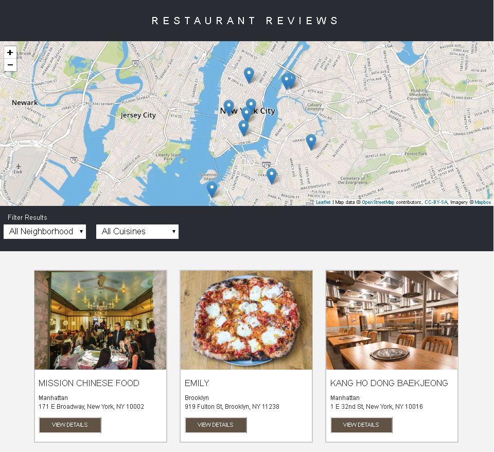

# Restaurant Reviews App Project

## Table of Contents
* [Project Overview](#project-overview)
* [Dependencies](#dependencies)
* [Installation](#installation)
* [Instructions](#instructions)

## Project Overview
Restaurant reviews app - project of the Udacity Front-End Web Developer Nanodegree Program.
Purpose of the project was to convert a static webpage to a mobile-ready web application.

## Dependencies
* Starter code provided by Udacity [Udacity](https://github.com/udacity/mws-restaurant-stage-1)
* [leafletjs](https://leafletjs.com/) with [Mapbox](https://www.mapbox.com/)

## Installation
1.  Download or clone repository
2.  In the folder, start up a simple HTTP server using python.
3.  In a terminal, check the version of Python you have: `python -V`.
4.  For Python 2.x, start the server with `python -m SimpleHTTPServer 8000`/
    For Python 3.x, start the server with `python3 -m http.server 8000`.
5.  If you don't have Python installed, navigate to Python's [website](https://www.python.org/) to download and install the software.
6.  With your server running, visit the site: `http://localhost:8000`

## Instructions
Explore the restaurant reviews app. For the updated page all page content is responsive and displays on a range of different display sizes. Accessibility concepts are implemented as well as offline availability using service worker, therefore making this site on its way to being a mobile-ready website.
